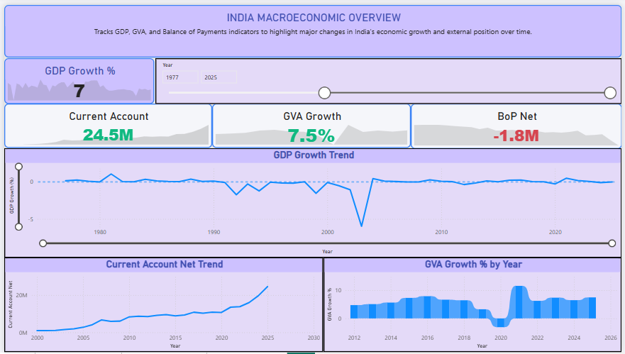
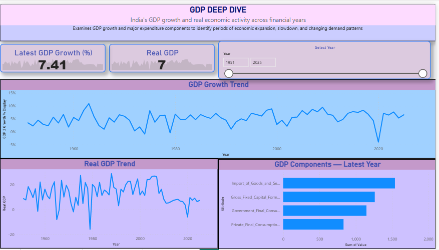
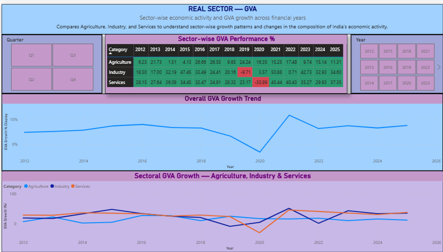

## 📊 Project Overview

An interactive Power BI dashboard designed to analyze India's macroeconomic performance using publicly available data from the **Reserve Bank of India (RBI)**.
The dashboard brings together key economic indicators including **GDP, Balance of Payments (BoP), and Gross Value Added (GVA)** to provide an interactive view of India's economic trends over time.

## 🎯 Project Objectives

- Analyze India's GDP growth and major expenditure components.
- Track Balance of Payments credit, debit, and net flows.
- Analyze GVA performance across Agriculture, Industry, and Services.
- Create interactive KPI indicators for important economic metrics.
- Enable year and quarter-based filtering for exploratory analysis.
- Present macroeconomic trends through interactive Power BI visualizations.

## 📂 Data Sources

The datasets used in this project are based on publicly available data published by the:

**Reserve Bank of India (RBI)**

The project uses three major datasets:

1. GDP — Gross Domestic Product and expenditure components
2. Balance of Payments — External sector transactions
3. GVA / Real Sector — Sector-wise economic activity

> Data source: Reserve Bank of India (RBI) public datasets.

---

## 🛠️ Tools & Technologies

- **Power BI Desktop**
- **DAX**
- **Power Query**
- **Python**
- **Pandas**
- **Data Modeling**
- **Microsoft Excel**

---

## 🧹 Data Preparation

The source RBI datasets required structural cleaning and transformation before visualization.

The preparation process included:

- Removing unnecessary and duplicate fields.
- Handling inconsistent column structures.
- Reshaping datasets using Power Query.
- Standardizing year and quarter information.
- Converting data types appropriately.
- Identifying missing values and reporting gaps.
- Preserving genuine missing observations instead of replacing them with misleading values.

Python and Pandas were also used for initial data inspection and structural cleaning.

---

## 🏗️ Data Model

A star-schema-oriented model was created to connect the independent RBI datasets.

The model includes:

- GDP fact table
- Balance of Payments fact table
- GVA / Real Sector fact table
- Shared Financial Year / Date dimension

The shared dimension enables consistent time-based filtering and analysis across the dashboard.

---

## 📐 DAX & Measures

DAX measures were created to support dynamic KPI calculations and analytical visualizations.

Examples include:

- GDP Growth %
- Latest GDP Growth
- Real GDP
- Current Account Net
- Latest Current Account Net
- Latest BoP Net
- GVA Growth
- Total Credit
- Total Debit
- Net Balance

These measures allow the dashboard to respond dynamically to user selections and filters.

---

# 📑 Dashboard Pages

## 1. India Macroeconomic Overview

Provides a high-level summary of India's economic performance.

### Includes:

- GDP Growth KPI
- Current Account KPI
- GVA Growth KPI
- Balance of Payments Net KPI
- GDP growth trend
- Current Account Net trend
- GVA growth trend
- Year and Quarter filtering

---

## 2. GDP Deep Dive

Focuses on India's GDP performance and major expenditure components.

### Includes:

- Latest GDP Growth
- Real GDP
- GDP growth trend
- Real GDP trend
- GDP expenditure component comparison
- Year-based analysis

---

## 3. External Sector — Balance of Payments

Analyzes India's external sector transactions.

### Includes:

- Balance of Payments trend
- Credit vs Debit comparison
- Latest BoP Net
- Selected-period Credit
- Selected-period Debit
- Account-level analysis
- Decomposition Tree for hierarchical exploration

---

## 4. Real Sector — GVA

Analyzes sector-wise economic activity and GVA growth.

### Includes:

- Agriculture performance
- Industry performance
- Services performance
- Sector-wise GVA comparison
- Overall GVA growth trend
- Sectoral GVA growth trends
- Year and Quarter filtering
- Conditional formatting for sector performance

---

## 💡 Key Analytical Insights

The dashboard enables users to explore:

- Long-term changes in India's GDP growth.
- Changes in India's external-sector position.
- Credit and debit movements within Balance of Payments.
- Sector-wise GVA performance.
- The changing contribution of Agriculture, Industry, and Services.
- Periods of stronger and weaker economic growth.

---

## 📸 Dashboard Preview

### Overview



### GDP Deep Dive



### External Sector


### Real Sector



---
---
## 📁 Project Structure

```text
india-macroeconomic-dashboard-powerbi/
│
├── README.md
├── India_Macroeconomic_Dashboard.pbix
│
└── screenshots/
    ├── overview.png
    ├── gdp-deep-dive.png
    ├── external-sector.png
    └── real-sector.png
